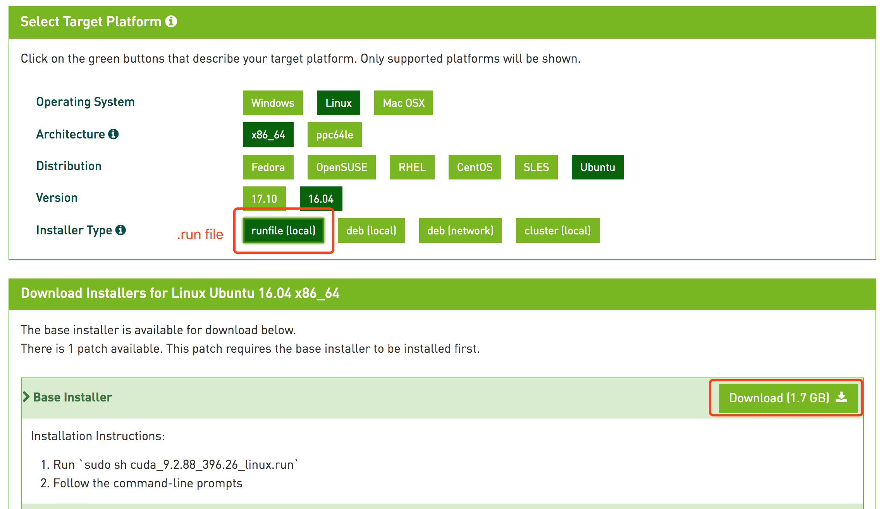
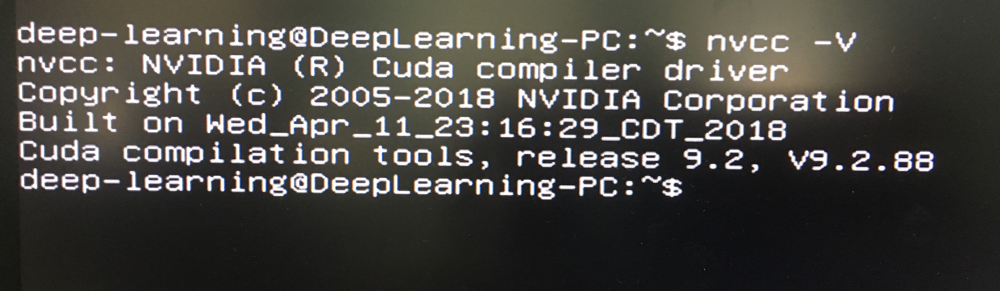
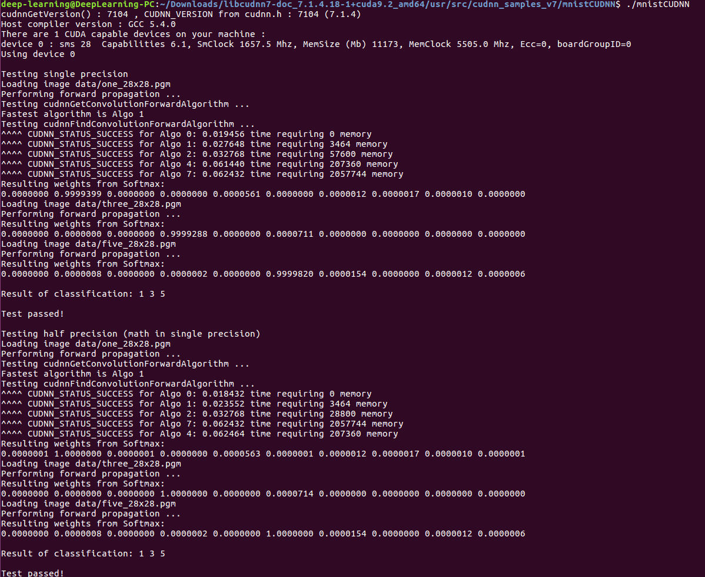
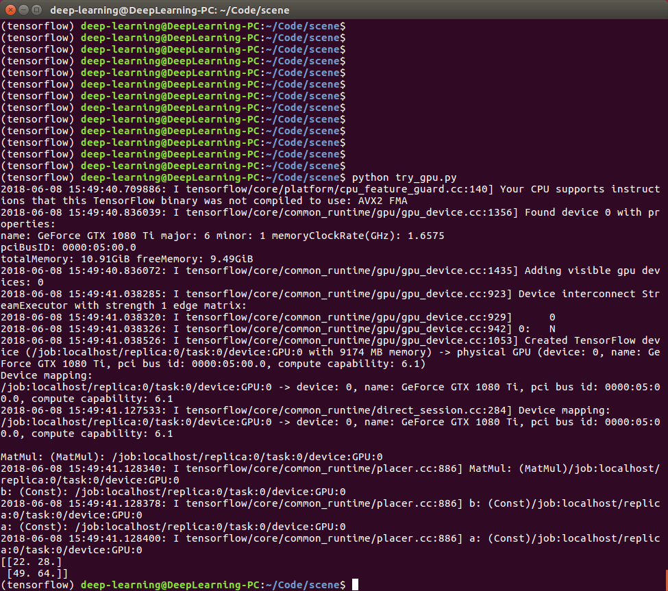

### 1 配置
主板：ASUS X99 -E WS，特点：单CPU,
支持8*16 PCIE通道

CPU： i7 6850k, 40 lanes

内存：16g*2

SSD：256g Sumsung

HDD：2T

GPU： MSI GTX 1080 Ti 一个
##### Reference:
1. [A Full Hardware Guide to Deep Learning](http://timdettmers.com/2015/03/09/deep-learning-hardware-guide/)
1. [深度学习（TensorFlow）环境搭建：（一）硬件选购和主机组装](https://www.cnblogs.com/xuliangxing/p/7543977.html)

### 2 安装 ubuntu 16.04
系统预装了win10，占用了SSD 128G， HDD 1T，需要加装ubuntu 16.04。虽然win10系统可以用基础的显卡驱动来通过1080Ti本身达到基本显示的目的，但，如果想在win10上发挥1080Ti的全部威力，依然需要另外安装显卡驱动；第二，只要出了win10系统，显卡就完全不能使用，包括安装ubuntu系统的过程。因此，在安装ubuntu系统地过程中，需要临时借助一个低配显卡（我们使用的是不需要插电，也不需要预装驱动即可运行的GTX 650）来连接主机与显示器，点亮系统。

点亮系统的过程中，请拔下1080Ti，防止系统识别错误。
#### 2.1 准备：
unbuntu 16.04系统U盘；
#### 2.2 开始：
开机，在显示华硕主板界面的时候按F2进入BOIS模式，切换到通过外置U盘再开机。（请按照引导优先使用键盘上的F1-12进行操作，更不容易出错）
成功后，系统会重启，然后进入U盘中的UbuntuBoot引导界面，选择Install Ubuntu（instead of Try Ubuntu）
选择语言后，continue；然后会有一个回退（go back）的步骤，此时可以选择系统默认安装，还是自定义（something else）。请选择something else，第一次选择默认安装后，系统图形界面除了guest模式，不能成功登陆.

>趁机熟悉了linux的一系列命令行操作：
* sudo apt-get 软件名，可以安装软件
* sudo service lightdm restart/stop
* ctrl+R 可以搜索历史命令行。
* tail -f /var/log/auth.log 可以查看日志，随时观察系统报错。
* ctrl alt F1-6, 可以切换六个不同的terminal界面。 ctrl alt F7 是图形界面
##### 2.2.1 分区

分区时参考了[ubuntu16.04分区设置](https://blog.csdn.net/zhangxiangweide/article/details/74779652)的法1，
在SSD上分出:

* ```/``` 主分区120g（装系统默认配置文件，如pool文件，etc文件等等）
* ```/swap``` 16g（参考内存一共32g）
* ```/boot``` 1.1g（引导盘）
在HDD上:
* 只分了一个盘，分出```/home``` 931.5g。

注意：最下面的引导盘选择，请选择有256g大小的整个SSD盘，而不要仅仅选择/boot 引导分区，装好后，会进入 rescue grubjiemian，并且网上寻找引导盘的set root + set prefix并不能拯救你😂
（附最终没有帮上忙的切换引导盘代码:
```
grub rescue>ls
grub rescue>set root = (hd0,msdos5)
grub rescue>set prefix = (hd0,msdos5)/boot/grub
grub rescue>insmod normal
grub rescue>normal
```

（It turns out to be useless）

### 3 GTX1080 Ti 显卡驱动安装攻略

#### 3.0
安装完系统之后，关闭主机，把1080 Ti插到主板上（记得给尊贵的1080 Ti插电），并且把显示器的连接线从低配版显卡换到 1080 Ti上，__！但是！ 不要把低配显卡拔掉，否则系统仍然无法正确显示。__（驱动还没装成，同志仍需努力！)
##### 可跳过的步骤:
（我们是遵循了的，不确定如果不遵循会不会报错，有攻略称可有可无。）

在启动主板时，按F2进入BOIS模式。进入高级选项(F7),找到BOOT模块，找到secure boot，将UEFI windows 关闭成other OS（此处描述仅限华硕X99主板，其他主板的开关secure boot的位置可能略有不同）
然后 press F10 save and exit, the system will reboot.

#### 3.1 安装ppa库
```sudo add-apt-repository ppa:graphics-drivers/ppa > ppa.tmp```
输入这一行命令之后，系统会告诉你当下比较主流的Nvidia驱动版本。由于打印过长，
使用```> ppa.tmp```把output 导出成文件查看。
目前的稳定版是390，因此我们一会下载nvidia-390。

#### 3.2 关闭图形化界面环境
```sudo service lightdm stop```
#### 3.3 下载
```sudo apt-get update && sudo apt-get install nvidia-390```
#### 3.4 验证
`nvidia-smi`
#### 3.5 补充
cuda 9.2 需要R396的nvidia驱动版本，所以前期装错了。本以为需要卸掉显卡驱动，重新翻出低配显卡，结果发现`sudo apt-get install nvidia-driver-396`就完美地解决了问题！它会自动卸载原有的驱动，只需要重装就可以。
##### Reference
1. [深度学习（TensorFlow）环境搭建：（二）Ubuntu16.04+1080Ti显卡驱动
](https://www.cnblogs.com/xuliangxing/p/7569946.html)
1. [Ubuntu16.04 + 1080Ti深度学习环境配置教程](https://www.jianshu.com/p/5b708817f5d8)

### 4 安装CUDA 9.2
#### 4.1 Download .run file
安装cuda，可以在[官网](https://developer.nvidia.com/cuda-downloads)上选择适配系统的型号进行下载

#### 4.2 Dependency libraries
因为cuda .run 文件有1.7g，因此需要一段时间下载，在这期间可以安装一下正式装cuda时需要的依赖库:

```
sudo apt-get install freeglut3-dev build-essential libx11-dev libxmu-dev libxi-dev libgl1-mesa-glx libglu1 ```

I still get
```Missing recommended library: libXi.so```  during installing cuda though I succesfully download the dependency library libXi, but it seemed unaffective.
#### 4.3 execute .run file
`sudo sh cuda_8.0.61_375.26_linux.run`

__Be Careful: Say no when asked `Install NVIDIA Accelarate Graphic Driver...` ! You have already installed it.__
#### 4.4 Setting Envirnment Params
open .bashrc file:
`sudo vim ~/.bashrc `
and then type:
```
export PATH=/usr/local/cuda-8.0/bin:$PATH  
export LD_LIBRARY_PATH=/usr/local/cuda-8.0/lib64:$LD_LIBRARY_PATH
export CUDA_HOME=/usr/local/cuda```
into it.(press `i` to insert, and press `esc` and type`:wq` to save)

Let the envirnment Params come into effect:
`sudo source ~/.bashrc`
#### 4.5 Verify the installation

```
# 切换到cuda-samples所在目录
cd /usr/local/cuda-8.0/samples 或者 cd /home/NVIDIA_CUDA-8.0_Samples

# 没有make，先安装命令 sudo apt-get install cmake，-j是最大限度的使用cpu编译，加快编译的速度
make –j

# 编译完毕，切换release目录（/usr/local/cuda-8.0/samples/bin/x86_64/linux/release完整目录）
cd ./bin/x86_64/linux/release

# 检验是否成功，运行实例
./deviceQuery

# 可以认真看看自行结果，它显示了你的NVIDIA显卡的相关信息，最后能看到Result = PASS就算成功。
```

`nvcc -V` or `nvcc --version`

### 5 Install cudnn 7.1.4
#### 5.1 Download and Install
[Download](https://developer.nvidia.com/rdp/cudnn-download)
account: use my Gmail.
```
#解压文件
tar -zxvf cudnn-8.0-linux-x64-v7.tgz

#切换到刚刚解压出来的文件夹路径
cd cuda
#复制include里的头文件
sudo cp include/cudnn.h  /usr/local/cuda/include/

#复制lib64下的lib文件到cuda安装路径下的lib64（记得转到lib64文件里执行下面命令）
sudo cp lib*  /usr/local/cuda/lib64/

#设置权限
sudo chmod a+r /usr/local/cuda/include/cudnn.h
sudo chmod a+r /usr/local/cuda/lib64/libcudnn*

#======更新软连接======
cd /usr/local/cuda/lib64/
sudo rm -rf libcudnn.so libcudnn.so.7   #删除原有动态文件，版本号注意变化，可在cudnn的lib64文件夹中查看   
sudo ln -s libcudnn.so.7.0.2 libcudnn.so.7  #生成软衔接（注意这里要和自己下载的cudnn版本对应，可以在/usr/local/cuda/lib64下查看自己libcudnn的版本）
sudo ln -s libcudnn.so.7 libcudnn.so #生成软链接
sudo ldconfig -v #立刻生效```
#### 5. Verify

### 6 安装TensorFlow
需要cuda版本制定 9.0，不可以使用 9.2。

debug 过程学会了添加软连接技能
```
ln -s libcudart.so.9.2 libcudart.so.9.0```
新建libcudart.so.9.0指向9.2。
以及sublime列编辑技能，command shift L 后，使用鼠标中键即可列编辑。

#### How to get real time gpu monitoring:
```
sudo watch nvidia-smi```
Here is the [nvidia-smi documentation](https://developer.download.nvidia.com/compute/DCGM/docs/nvidia-smi-367.38.pdf)

##### Reference
1. [深度学习（TensorFlow）环境搭建：（三）Ubuntu16.04+CUDA8.0+cuDNN7+Anaconda4.4+Python3.6+TensorFlow1.3](https://www.cnblogs.com/xuliangxing/p/7575586.html)
